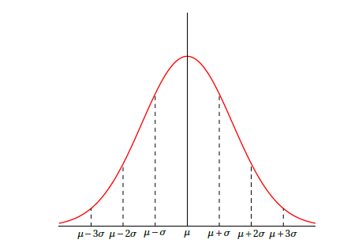

This is my collection of Tikz art.

****


```tex
\begin{tikzpicture}[
    level distance=8mm, sibling distance=10mm
    ]
    \node{${}_0C_0$}
    child { node {${}_1C_0$}
        child { node {${}_2C_0$}
            child { node {${}_3C_0$} 
                child { node{${}_4C_0$} }
                child { node{${}_4C_1$} }
            }
            child { node {${}_3C_1$}
                child { node {\phantom{3}} }
                child { node {${}_4C_2$} }
            }
        }
        child { node {${}_2C_1$}
            child { node {\phantom{3}} }
            child { node {${}_3C_2$}
                child { node{\phantom{6}} }
                child { node{${}_4C_3$} }
            }
        }
    }
    child { node {${}_1C_1$}
        child { node {\phantom{2}} }
        child { node {${}_2C_2$}
            child { node {\phantom{3}} }
            child { node {${}_3C_3$} 
                child { node{\phantom{4}} }
                child { node{${}_4C_4$} }
            }
        }
    };
    \end{tikzpicture}
```

****


```tex
\begin{tikzpicture}[
level distance=8mm, sibling distance=10mm
]
\node{1}
child { node {1}
    child { node {1}
        child { node {1} 
            child { node{1} }
            child { node{4} }
        }
        child { node {3}
            child { node {\phantom{3}} }
            child { node {6} }
        }
    }
    child { node {2}
        child { node {\phantom{3}} }
        child { node {3}
            child { node{\phantom{6}} }
            child { node{4} }
        }
    }
}
child { node {1}
    child { node {\phantom{2}} }
    child { node {1}
        child { node {\phantom{3}} }
        child { node {1} 
            child { node{\phantom{4}} }
            child { node{1} }
        }
    }
};
\end{tikzpicture}
```

****


```tex
\def\firstcircle{(0,0) circle (1.5cm)}
\def\secondcircle{(0:2cm) circle (1.5cm)}
\colorlet{circle edge}{blue!50}
\colorlet{circle area}{blue!20}
\tikzset{filled/.style={fill=circle area, draw=circle edge, thick}, outline/.style={draw=circle edge, thick}}

\begin{tikzpicture}[scale=.7]
    \draw[filled] \firstcircle node {$A$};
    \draw \secondcircle node {$B$};
    \draw[outline] \secondcircle;
\end{tikzpicture}

\begin{tikzpicture}[scale=.7]
    \draw \firstcircle node {$A$};
    \draw[filled] \secondcircle node {$B$};
    \draw[outline] \firstcircle;
\end{tikzpicture}

\begin{tikzpicture}[scale=.7]
    \draw[filled] \firstcircle node {$A$}
                \secondcircle node {$B$};
    \node[anchor=south] at (current bounding box.north) {$A\cup B$};
\end{tikzpicture}

\begin{tikzpicture}[scale=.7]
    \begin{scope}
        \clip \firstcircle;
        \fill[filled] \secondcircle;
    \end{scope}
    \draw[outline] \firstcircle node {$A$};
    \draw[outline] \secondcircle node {$B$};
    \node[anchor=south] at (current bounding box.north) {$A \cap B$};
\end{tikzpicture}
```

****


```tex
\begin{tikzpicture}
    \begin{axis}[
        width=8cm, height=5cm,
        samples=200,
        minor x tick num = 0,
        minor y tick num = 0,
        axis x line=bottom,
        axis y line=middle,
        xmin=-1, xmax=8,
        ymin=0, ymax=0.8,
        xlabel=$x$, ylabel=$f(x)$,
        xlabel style={at={(1,0)}, anchor=north west},
        ylabel style={rotate=0, at={(0.15,1)}, anchor=south east},
        xtick={0,1,2,3,4,5},
        ytick={},
        yticklabels={}
    ]
    \addplot[red,thick,domain=0:7,name path=g1] {x*exp(-x)};
    \path[name path=l1] (2,0) -- (2,10);
    \path[name intersections={of=g1 and l1}];
    \addplot[gray,domain=2:7,draw=none,fill=gray!40]{x*exp(-x)} \closedcycle;
    \draw (intersection-1) -- (2,0);
    %\draw (2,0) node[below]{$\mu$};
    \end{axis}
    \draw (2.15,-0.5) node[below]{$\mu$};
\end{tikzpicture}
```

****


```tex
\begin{tikzpicture}[domain=0:1,samples=200,scale=0.8]
        \begin{axis}[%
            minor tick num = 0,
            % axis x line = bottom,
            % axis y line = none,
            axis lines=middle,
            % axis line style=thick,
            xmin=0, xmax=1.01,
            ymin=0, ymax=4.0,
            ticks=none,
            % xlabel=$x$,
            every axis x label/.style={at={(current axis.right of origin)},anchor=north west},
            clip=false
        ]
        \addplot [smooth, red, thick, name path=f] {betapdf(x,4,3)};
        \path[name path=axis] (axis cs:0,0) -- (axis cs:1,0);
        % \addplot [domain=0:0.5,smooth, blue, thick,fill=gray!20] {betapdf(x,4,3)} \closedcycle;
        \addplot [fill=gray,fill opacity=0.2] fill between[of=f and axis,soft clip={domain=0.0:0.57-0.2}];
        \addplot [fill=gray,fill opacity=0.2] fill between[of=f and axis,soft clip={domain=0.57+0.2:1}];

        \path (0.57,0) coordinate (MX);
        \path (0.57,3) coordinate (MY);
        \path ($(MX)+(-0.2,0)$) coordinate (X1);
        \path ($(MY)+(-0.2,0)$) coordinate (Y1);
        \path ($(MX)+(0.2,0)$) coordinate (X2);
        \path ($(MY)+(0.2,0)$) coordinate (Y2);

        \draw[dashed] (MX) node[below]{$\mu$} -- (MY);
        \path[name path=l] (X1) -- (Y1);
        \path[name intersections={of=f and l}];
        \path (intersection-1) coordinate (A);
        \draw (X1) node[below]{$\mu-k\sigma$} -- (A);

        \path[name path=l] (X2) -- (Y2);
        \path[name intersections={of=f and l}];
        \path (intersection-1) coordinate (A);
        \draw (X2) node[below]{$\mu+k\sigma$} -- (A);

        \draw[<->] ($(X1)+(0,1)$) -- node[below]{$k\sigma$} ($(MX)+(0,1)$);
        \draw[<->] ($(MX)+(0,1)$) -- node[below]{$k\sigma$} ($(X2)+(0,1)$);

    \end{axis}
    \end{tikzpicture}
```

****



```tex
\begin{tikzpicture}[domain=-4:4,samples=200,scale=0.8]
    \begin{axis}[%
        % enlarge x limits=false,
        minor tick num = 0,
        % axis x line = bottom,
        % axis y line = none,
        % axis lines=middle,
        % axis line style=thick,
        axis lines=none,
        xmin=-4.0, xmax=4.0,
        ymin=0, ymax=0.5,
        ticks=none,
        % xlabel=$x$,
        every axis x label/.style={at={(current axis.right of origin)},anchor=north west},
        clip=false
    ]
    \addplot [smooth, red, thick, name path=f] {normpdf(x,0,1)};

    \path (0,0) coordinate (MX);
    \path (0,0.5) coordinate (MY);
    \path (-1,0) coordinate (X1);
    \path (-1,0.5) coordinate (Y1);
    \path (1,0) coordinate (X2);
    \path (1,0.5) coordinate (Y2);
    \path (-2,0) coordinate (X3);
    \path (-2,0.5) coordinate (Y3);
    \path (2,0) coordinate (X4);
    \path (2,0.5) coordinate (Y4);
    \path (-3,0) coordinate (X5);
    \path (-3,0.5) coordinate (Y5);
    \path (3,0) coordinate (X6);
    \path (3,0.5) coordinate (Y6);

    \draw (-4,0) -- (4,0);
    \draw (0,0) -- (0,0.5);

    \draw (MX) node[below]{\footnotesize$\mu$};

    \path[name path=l] (X1) -- (Y1);
    \path[name intersections={of=f and l}];
    \path (intersection-1) coordinate (A1);
    \draw[dashed] (X1) node[below]{\footnotesize$\mu-\sigma$} -- (A1);

    \path[name path=l] (X2) -- (Y2);
    \path[name intersections={of=f and l}];
    \path (intersection-1) coordinate (A2);
    \draw[dashed] (X2) node[below]{\footnotesize$\mu+\sigma$} -- (A2);

    \path[name path=l] (X3) -- (Y3);
    \path[name intersections={of=f and l}];
    \path (intersection-1) coordinate (A3);
    \draw[dashed] (X3) node[below]{\footnotesize$\mu-2\sigma$} -- (A3);

    \path[name path=l] (X4) -- (Y4);
    \path[name intersections={of=f and l}];
    \path (intersection-1) coordinate (A4);
    \draw[dashed] (X4) node[below]{\footnotesize$\mu+2\sigma$} -- (A4);

    \path[name path=l] (X5) -- (Y5);
    \path[name intersections={of=f and l}];
    \path (intersection-1) coordinate (A5);
    \draw[dashed] (X5) node[below]{\footnotesize$\mu-3\sigma$} -- (A5);

    \path[name path=l] (X6) -- (Y6);
    \path[name intersections={of=f and l}];
    \path (intersection-1) coordinate (A6);
    \draw[dashed] (X6) node[below]{\footnotesize$\mu+3\sigma$} -- (A6);

\end{axis}
\end{tikzpicture}
```

